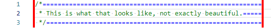
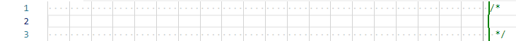
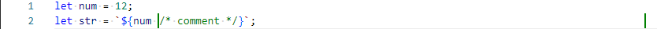
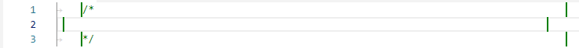

# Comment Rulers

Comment Rulers is a Visual Studio Code extension that helps you keep your code's comments within a specified range by visualizing where the comment lines should start and end.

The extension adds green lines at the first and 80th character positions, allowing you to easily identify and adjust comments that aren't in the desired range.

With Comment Rulers, you can ensure that your comments are concise and easy to read, improving the readability and maintainability of your codebase.

## Features

Here's an example of what Comment Rulers looks like in action:


## Requirements

None

## Extension Settings

This extension contributes the following settings (which can be overwritten for every programming language):

* `comment-rulers.blockCommentDelimiters`: The delimiters for block comments.
* `comment-rulers.enabled`: Enable/disable drawing comment rulers.
* `comment-rulers.escapableChars`: Escapable delimiter characters.
* `comment-rulers.inlineCommentDelimiters`: The delimiters for inline comments.
* `comment-rulers.maxCommentLineLength`: The maximum length of a comment line.
* `comment-rulers.multiLineStringDelimiters`: The delimiters for multi-line strings (to ingore included comment delimiters).
* `comment-rulers.placeholderChar`: The placeholder character to align the rulers (CANT BE A SPACE).
* `comment-rulers.placeholderColor`: The CSS color of the placeholder character.
* `comment-rulers.rulerColor`: The CSS color of the rulers.
* `comment-rulers.rulerWidth`: The CSS border-width of the rulers.
* `comment-rulers.singleLineStringDelimiters`: The delimiters for single-line strings (to ingore included comment delimiters).

### Examples

To configure this extension for individual languages, use `Ctrl+Shift+P` and `>Preferences: Open User Settings (JSON)`.

- Enabling the extension for Java, Python and Ruby:
    ```jsonc
    {
        // [language_1][language_2]...[language_n]
        "[java][python][ruby]": {
            "comment-rulers.enabled": true
        }
    }
    ```
    

- [Default settings for the top 20 most popular programming languages](default_settings.jsonc)

- [Comment tests for the top 20 most popular programming languages](comment/tests/)

- Messing with other settings:
    ```jsonc
    {
        "comment-rulers.maxCommentLineLength": 60,
        "comment-rulers.placeholderChar": "=",
        "comment-rulers.placeholderColor": "blue", // CSS color
        "comment-rulers.rulerColor": "red", // CSS color
        "comment-rulers.rulerWidth": "2px" // border-width
    }
    ```
    

## Known Issues

- Rulers can be misplaced:
    

- Comments in string templates aren't supported:
    ```javascript
    let num = 12;
    let str = `${num /* comment */}`;
    ```
    Expected:
    

- Delimiters can't be configured to be just indented:
    This heredoc is terminated early, since it's not possible to configure that DOC can only be indented <<-DOC (vscode is wrong here):
    ```ruby
    <<-DOC
    A heredoc ended with DOC
    DOC
    ```
    Expected:
    

- Incorrect tab indentation isn't handled properly:
    


## Release Notes

### 1.0.5 (Apr 18. 2023)

- Made end delimiters of strings configurable
- Added ruler where the comment line should start
- Added examples
- Added default configuration for top 20 most popular programming languages
- Added comments tests for top 20 most popular programming languages

See [changelog](CHANGELOG.md) for all changes.

---

**Enjoy!**
