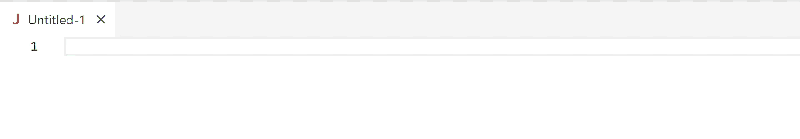
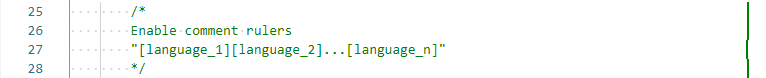

# Comment Rulers

Comment Rulers is a Visual Studio Code extension that helps you keep your code's comments within a specified length by visualizing where the comment line length reaches 80 characters.

The extension adds a green line at the end of the 80th character position of each comment line, allowing you to easily identify and adjust comments that exceed the desired length.

With Comment Rulers, you can ensure that your comments are concise and easy to read, improving the readability and maintainability of your codebase.

## Features



## Requirements

None

## Extension Settings

This extension contributes the following settings:

* `comment-rulers.blockCommentDelimiters`: The delimiters for block comments.
* `comment-rulers.emPerChar`: The number of em units per character (BREAKS THE LAYOUT IF SET INCORRECTLY).
* `comment-rulers.enabled`: Enable/disable Comment Rulers.
* `comment-rulers.escapableChars`: Escapable delimiter characters.
* `comment-rulers.inlineCommentDelimiters`: The delimiters for inline comments.
* `comment-rulers.maxCommentLineLength`: The maximum length of a comment line.
* `comment-rulers.multiLineStringDelimiters`: The delimiters for multi-line strings (to ingore included comment delimiters).
* `comment-rulers.singleLineStringDelimiters`: The delimiters for single-line strings (to ingore included comment delimiters).
* `comment-rulers.style`: The CSS style for the rulers.

## Known Issues

- Rounding errors can cause the rulers to be a few pixels misplaced:
    
- Comments in string templates aren't supported:
    ```javascript
    let num = 12;
    let str = `${num /* comment */}`;
     ```

## Release Notes

### 1.0.2 (Apr 16. 2023)

Detecting strings (to ingore included comment delimiters).
Escaping delimiters
Fixed features.gif

See [changelog](CHANGELOG.md) for all changes.

---

**Enjoy!**
