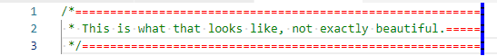

# Comment Rulers

Comment Rulers is a Visual Studio Code extension that helps you keep your code's comments within a specified length by visualizing where the comment line length reaches 80 characters.

The extension adds a green line at the end of the 80th character position of each comment line, allowing you to easily identify and adjust comments that exceed the desired length.

With Comment Rulers, you can ensure that your comments are concise and easy to read, improving the readability and maintainability of your codebase.

## Features


## Requirements

None

## Extension Settings

This extension contributes the following settings:

* `comment-rulers.backgroundColor`: The background color of the rulers.
* `comment-rulers.blockCommentDelimiters`: The delimiters for block comments.
* `comment-rulers.border`: The CSS border style of the rulers.
* `comment-rulers.color`: The color of the underscores to move the ruler.
* `comment-rulers.enabled`: Enable/disable drawing comment rulers.
* `comment-rulers.escapableChars`: Escapable delimiter characters.
* `comment-rulers.inlineCommentDelimiters`: The delimiters for inline comments.
* `comment-rulers.maxCommentLineLength`: The maximum length of a comment line.
* `comment-rulers.multiLineStringDelimiters`: The delimiters for multi-line strings (to ingore included comment delimiters).
* `comment-rulers.placeholder`: The placeholder character to move the ruler (CANT BE A SPACE).
* `comment-rulers.singleLineStringDelimiters`: The delimiters for single-line strings (to ingore included comment delimiters).

### Examples

To configure this extension for individual languages, use `Ctrl+Shift+P` and `>Preferences: Open User Settings (JSON)`.

- Enabling the extension for Java, Python and Ruby:
    ```jsonc
    {
        ...
        // [language_1][language_2]...[language_n]
        "[java][python][ruby]": {
            "comment-rulers.enabled": true
        }
    }
    ```

- Configuring the extension for Ruby:
    ```jsonc
    {
        ...
        // [language]
        "[ruby]": {
            ...
            "comment-rulers.blockCommentDelimiters": {
                // start: end
                "\n=begin": "\n=end",
                "<<-DOC": "DOC\n",
                "\n__END__\n": ""
            },
            "comment-rulers.inlineCommentDelimiters": [
                // start
                "#"
            ],
            "comment-rulers.multiLineStringDelimiters": [
                // start & end
                "\""
            ],
            "comment-rulers.singleLineStringDelimiters": [
                // start & end
                "'"
            ]
        }
    }
    ```

- Messing with other settings:
    ```jsonc
    {
        ...
        "comment-rulers.backgroundColor": "black", // html_color_name
        "comment-rulers.border": "2px dashed blue", // width border-style html_color_name
        "comment-rulers.color": "red", // html_color_name
        "comment-rulers.maxCommentLineLength": 60, // length
        "comment-rulers.placeholder": "=", // character
    }
    ```
    

## Known Issues

- Comments in string templates aren't supported:
    ```javascript
    let num = 12;
    let str = `${num /* comment */}`;
     ```

## Release Notes

### 1.0.4 (Apr 16. 2023)

- Fixed that block comments can be started by part of the second delimiter
- Made placeholder configurable

See [changelog](CHANGELOG.md) for all changes.

---

**Enjoy!**
